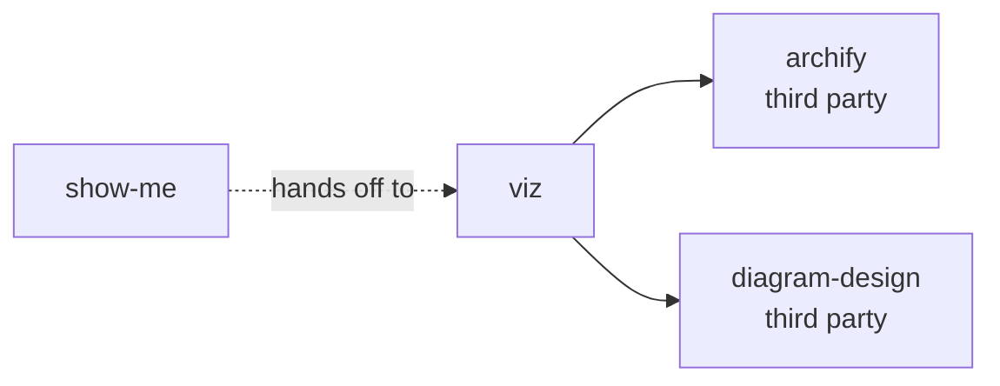

# skills

Personal Claude Code skills. Each directory holds one skill: a `README.md` for a person,
a `SKILL.md` that tells Claude how to do the job, and the scripts and schemas that job
needs.

Claude Code loads every directory under `~/.claude/skills/`. Clone this repository to
that path, or symlink the directories into it.

    git clone https://github.com/changda0616/skills.git ~/.claude/skills

## The skills

| Skill | What it does |
| --- | --- |
| [panel](panel/) | Runs a review across three agents — Claude, agy, Codex. Gate A reads the requirement before implementation; Gate B verifies the diff after it. |
| [viz](viz/) | Picks a diagram type for the subject, then builds one finished diagram as a standalone HTML file. |
| [show-me](show-me/) | Sketches the current topic inline — pseudocode, a call tree, a diff, a short Mermaid block. **A customised fork of a public skill.** |

## How they fit together

`show-me` sketches inline. It hands off to `viz` when the subject is a system rather than
a snippet. `viz` picks the type, then hands the drawing to `archify` or to
`diagram-design`.

`panel` stands alone. Nothing here calls it, and it calls nothing here.

## Third-party skills this repository depends on

These are public skills. This repository does not vendor them, so install them yourself.
Only `viz` needs them.

| Skill | Needed by | Where it comes from |
| --- | --- | --- |
| `archify` | [viz](viz/) | Draws the five system diagram types and validates the geometry. |
| `diagram-design` | [viz](viz/) | Draws every other chart type. Ships as a Claude Code plugin. |

Without `archify` and `diagram-design`, `viz` can only hand-author a single HTML file.

## External services

| Skill | Needs |
| --- | --- |
| panel | `node` 18+, the `agy` CLI, the `codex` CLI |
| viz | `open`, plus the third-party skills above |
| show-me | `open`, and [viz](viz/) for the handoff |

## Scope

This repository carries the skills written for this machine. It does not vendor a public
skill that Claude Code or a plugin already ships — with one exception.

[show-me](show-me/) is a **customised fork** of the public
[humanlayer/skills](https://github.com/humanlayer/skills) skill. It lives here because the
local edits, not the upstream text, are the reason to keep it: the handoff to `viz` names
a skill of this repository, so upstream cannot carry it. `show-me/README.md` pins the
upstream commit and lists every local change.

## Licence

The skills in this repository are MIT licensed. See [LICENSE](LICENSE).

[show-me](show-me/) is a customised fork of a skill from
[humanlayer/skills](https://github.com/humanlayer/skills), which is also MIT licensed.
Upstream's licence travels with the fork: see [show-me/LICENSE](show-me/LICENSE).
