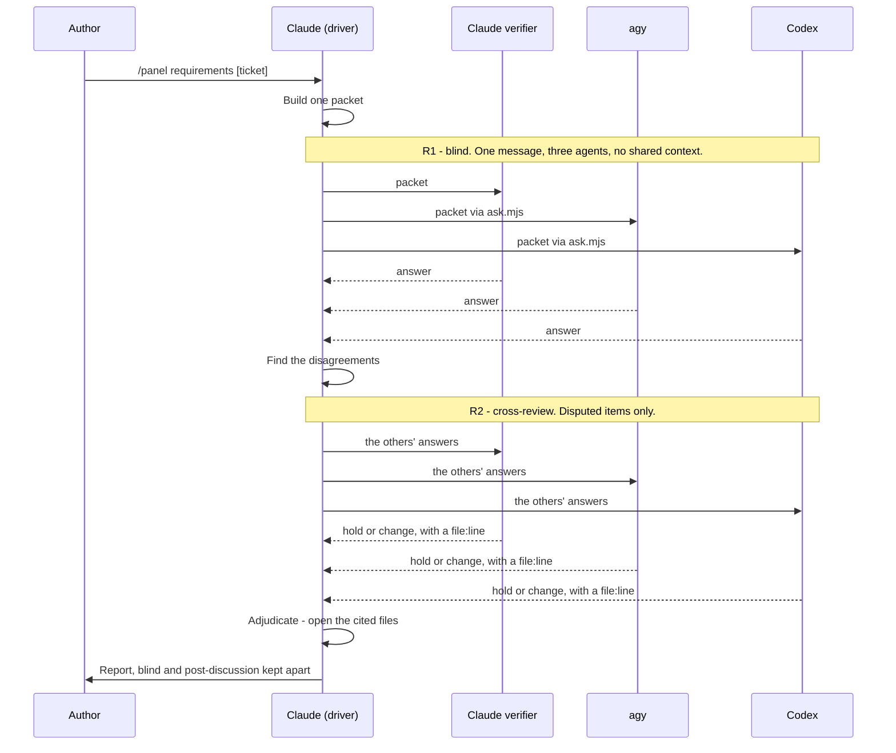

# panel

Run a review across three agents — Claude, agy, Codex — so that a single model's blind
spot does not become the whole answer.

    /panel requirements <ticket>
    /panel verify [target]

Two gates. **Gate A** analyses the requirement before implementation. **Gate B** verifies
the diff against the criteria Gate A produced. Run both on a `feat` or `refactor` branch.
Skip both on `fix`, `chore`, `docs` and `test`.

## Dependencies

| Kind | What | Why |
| --- | --- | --- |
| CLI | `node` (18 or newer) | Runs `scripts/ask.mjs`. It uses top-level `await` and `node:` imports. |
| CLI | `agy` | The second panelist. `ask.mjs` spawns it with `--output-format json`. |
| CLI | `codex` | The third panelist. `ask.mjs` spawns `codex exec --json -`. |
| Tool | The Agent tool | The first panelist runs as a Claude subagent in the session. |

Both CLIs must already be authenticated. This skill reads no credential of its own and
carries no `.env`.

No other skill depends on this one, and it depends on no other skill.

## Files

| Path | What it is |
| --- | --- |
| `SKILL.md` | The instructions Claude follows. |
| `scripts/ask.mjs` | Spawns one CLI agent and prints one JSON line. |
| `schemas/gate-a.json` | The shape of a Gate A answer: `criteria`, `risks`, `open_questions`, `suggestions`. Paste it into the packet. |
| `schemas/gate-b.json` | The shape of a Gate B answer: `criteria` with `verdict` and `soundness`, plus `criteria_gaps`. Paste it into the packet. |

## How one gate runs



Spawn all three in **one message**, and read nothing until every one returns. A verifier
that sees another's answer stops being independent, and independence is the only thing
this skill buys.

Stop after R2. Items still in dispute go to the author, not to a third round.

## The helper contract

`ask.mjs <agy|codex> <promptFile> <expectedIds|count|-> [timeoutSec]` prints one JSON
line:

```
{ "ok": true,  "data": {...}, "agent": "agy" }
{ "ok": false, "reason": "empty|waiting|unparseable|id_mismatch|duplicate_ids|shape_mismatch|count_mismatch|timeout|spawn_failed|bad_usage", "stderr": "...", "raw": "..." }
```

`ok` is decided by mechanical checks only: the reply parses as JSON, it matches the shape,
and its criteria ids are exactly the set you asked for, with no repeats. The helper judges
nothing else.

Pass the ids for Gate B, where each criterion carries an `id`. Gate A criteria carry no
`id`, so pass a count or `-` there.

**Neither CLI takes a schema argument.** The packet is the only place an agent learns the
shape, so end every packet with the schema itself and the output contract from `SKILL.md`.

**`waiting` is its own reason.** agy spawns a subagent for research, and its progress text
used to land in front of the answer and break the parse. The contract now tells the agent
to emit `{"status":"waiting", ...}` alone when it has nothing yet. Retry that agent. A
waiting object that arrives in front of a real answer is dropped, so a mixed reply still
counts as a vote.

**`ok: false` means that agent did not vote.** Do not read it as agreement, and do not let
two answers plus one silence pass as "all three agree".

**Never read an agent's `status` field, and never trust an exit code.** agy reports
`SUCCESS` and exit 0 when it produced nothing at all. Content is the only signal.

## Adjudication is yours

Open the files and read the cited `file:line` yourself for every disputed item. This is
the one step in the flow that is not another model's opinion, and it is what stops three
agents from sharing one hallucination. Tallying votes just adds a fourth opinion.

You are Claude, and so is one of the three verifiers. Treat a lone dissent against a
Claude majority as the case most worth opening the file for.
