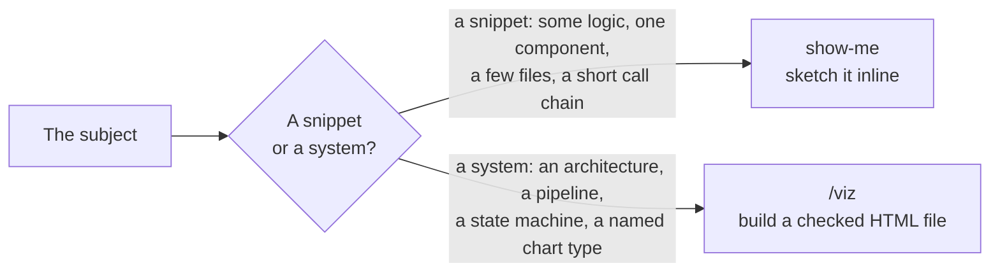

# show-me — a customised fork

> **This is a modified copy of a public skill.** It is not the upstream version, and it
> does not track upstream. Read this file before you report a bug against it.

Help the user understand the current topic visually — pseudocode, a call tree, a component
tree, a file tree, a short Mermaid block, a diff, or one focused HTML file. Pick the
smallest view that makes the point.

## Provenance

| | |
| --- | --- |
| Upstream | [humanlayer/skills](https://github.com/humanlayer/skills), `plugins/show-me/skills/show-me/SKILL.md` |
| Pinned at | commit `3c26291`, plugin version 1.0.1 |
| Local state | Upstream's 127 lines, unchanged, plus three sections appended |
| Licence | MIT. Upstream's licence text sits beside this file as [LICENSE](LICENSE). |

`SKILL.md` carries the same note on its first line, so the provenance travels with the
file when someone copies it out.

## What this fork adds

Nothing upstream is removed or rewritten. The fork appends three sections.

| Section | What it does | Why |
| --- | --- | --- |
| `### name the view` | Say in one line what the chosen view shows, before drawing it. | The user does not know the diagram vocabulary. A view nobody can name teaches nothing. |
| `### when a real diagram earns it` | Hand off to `/viz` when the subject is a system rather than a snippet. | Upstream has no `/viz`, because [viz](../viz/) is a skill of this repository. Without the handoff, `show-me` sketches an architecture inline and the result is worse than a checked file. |
| `### output` | Write every HTML file to disk and open it. Never publish an Artifact to claude.ai. | The work is internal. |

## Dependencies

| Kind | What | Why |
| --- | --- | --- |
| Skill | [viz](../viz/) | The handoff target. Optional — without it, `show-me` stays inline and draws no standalone file. |
| CLI | `open` | Opens a finished HTML file. macOS. |

No MCP server, no local secret.

## Where the line falls

Stay in `show-me` when a code block, a tree, or a short Mermaid block already carries the
point.

## Updating from upstream

Upstream may move on. To take a newer version, diff it against the first 127 lines here,
apply what changed, then re-append the three sections above:

    curl -sSL https://raw.githubusercontent.com/humanlayer/skills/<commit>/plugins/show-me/skills/show-me/SKILL.md \
        | diff - SKILL.md

Update the pinned commit in the table above and in `SKILL.md` when you do.
