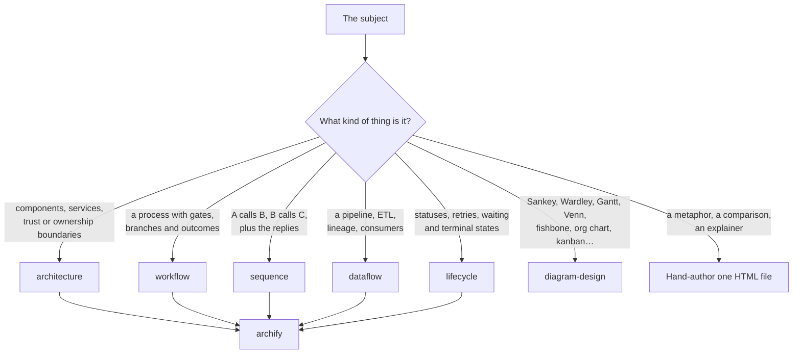

# viz

Deliver one finished diagram for a subject and save it as a local standalone HTML file.

    /viz

The user does not know the diagram types, so the choice and the teaching are this skill's
job, not theirs. Never ask which type to draw. Decide, explain the type in two or three
sentences, then build.

## Dependencies

This skill routes to another skill; it draws nothing itself. `archify` and
`diagram-design` live outside this repository.

| Kind | What | Why |
| --- | --- | --- |
| Skill | `archify` | Draws the five system types. It validates geometry, so routes do not cross opaque nodes and labels do not mask each other. |
| Skill | `diagram-design` | Draws everything else — Sankey, Wardley map, Gantt, Venn, fishbone, treemap, org chart, and more. Ships as a Claude Code plugin. |
| Skill | [show-me](../show-me/) | Not required, and it lives in this repository. `/show-me` hands off here when the user wants a finished file instead of an inline sketch. Its fork adds that handoff; upstream has none. |
| CLI | `open` | Opens the finished HTML file. macOS. |

Install `archify` and `diagram-design` first. Without them this skill can only
hand-author a single HTML file.

## Picking the type and the tool

`archify` covers only its five types. `diagram-design` covers those five and many more,
but does not validate geometry. Prefer `archify` when both fit.

Do not force a tool onto a subject that is not a system.

## Where the file goes

Write to `~/Desktop/` unless the user names a path. Never write inside a git working
tree, because the file is not part of the project.

Name the file after the subject, not after the tool: `password-reset-sequence.html`.

Never publish an Artifact to claude.ai, because the work is internal. Ask first if the
user wants a link.

## Scope

One diagram per request. If the subject needs two, say which second diagram you would add
and why, then let the user ask for it.
